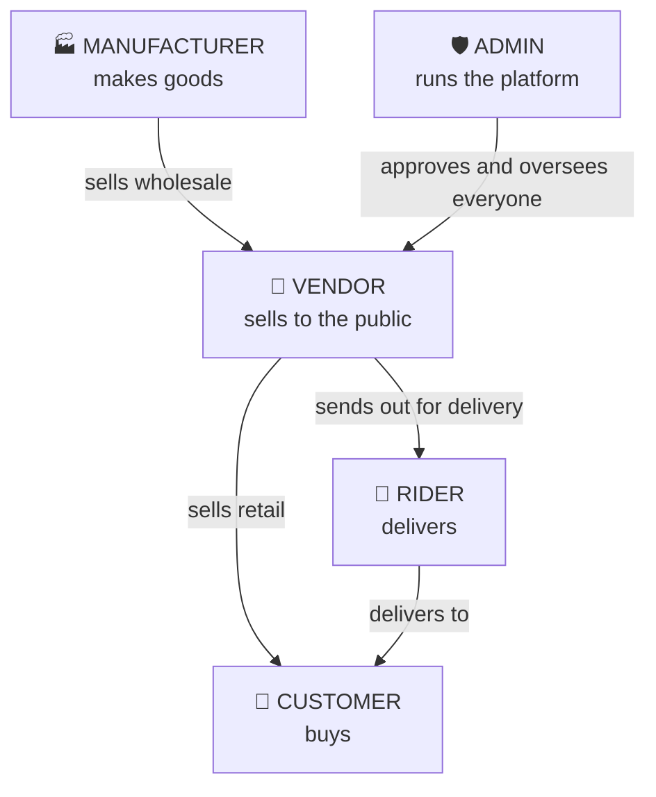
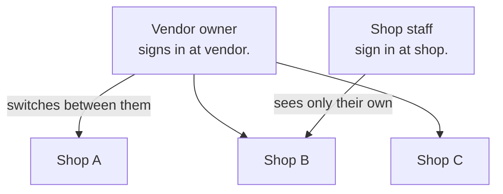
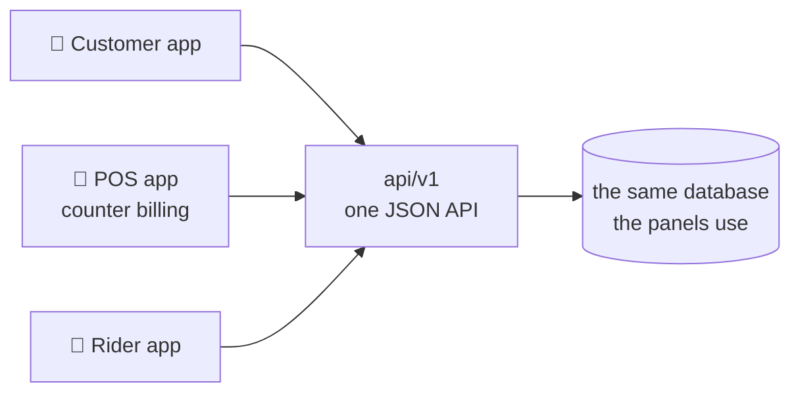
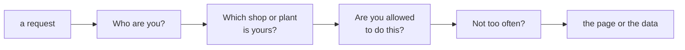
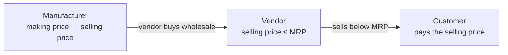

# Shiplore

A multi-tenant omnichannel commerce platform built on CodeIgniter 4.

Sellers list products, run physical shops with a POS, and fulfil orders through their own
riders. Manufacturers sell wholesale to those sellers. Customers buy on a storefront.
Each of those audiences gets its own panel on its own subdomain, sharing one codebase and
one database.

> `system/` is the framework. `app/` is the product. This is **not** a vanilla CodeIgniter
> install — do not upgrade `system/` without reading *Framework* below.

---

## Scale

| | Files | Lines |
| --- | ---: | ---: |
| Controllers | 148 | 25,673 |
| Views | 356 | 24,078 |
| Models | 116 | 18,361 |
| Libraries | 88 | 10,285 |
| Config | 45 | 7,000 |
| Filters, helpers, commands | 19 | 1,236 |
| **Application total** | **772** | **86,633** |
| Tests | 173 | 26,491 |

**844 routes** across eight surfaces · **262 tables** in 85 schema files · **1,473 tests**

Routes by panel:

| admin | api/v1 | vendor | manufacturer | store | monline | rider |
| ---: | ---: | ---: | ---: | ---: | ---: | ---: |
| 310 | 166 | 161 | 77 | 58 | 14 | 5 |

In production this carries roughly **1.8 million product variants** across about **10,000
shops**, which is why anything touching `product_variants` — a backfill, an index change, a
migration — needs a plan rather than a single `UPDATE`.

---

## Who uses Shiplore

Five kinds of people, each with their own way in.



## One vendor, many shops

A vendor signs in once and works across **all** their shops from a single window. Their
shop staff sign in separately and see **only their own shop** — same codebase, different
door.



Manufacturers work the same way: an owner signs in at `manufacturer.` and spans every
plant; unit staff sign in at `mshop.` and see only theirs.

## The panels

Each audience gets its own web address. Every panel is locked to its own subdomain, so a
vendor page simply does not exist on the admin address.

| Panel | Address | Who signs in |
| --- | --- | --- |
| Admin | `admin.` | platform staff |
| Vendor | `vendor.` | vendor owners — all their shops |
| Shop | `shop.` | shop staff — one shop |
| Manufacturer | `manufacturer.` | manufacturer owners — all their plants |
| Unit | `mshop.` | plant staff — one plant |
| Monline | `monline.` | the wholesale marketplace |
| Rider | `rider.` | delivery riders |
| Storefront | main domain | customers |

## The mobile and desktop apps

Three shipped apps talk to the same backend over one JSON API. They authenticate with a
token rather than a browser session.



**These apps are already in users' hands and cannot be updated in step with the server**,
so anything `api/v1` returns has to keep working. That constraint shapes a lot of the
code: new features get new tables and new endpoints rather than changing existing ones.

The POS app also works **offline** and syncs when it reconnects — `php spark sync:work`
drains that queue.

## How a request is handled

Every request, from a browser or an app, goes through the same four checks before it
reaches any code that touches data.



In the code those are `WebAuthFilter` / `JwtAuthFilter`, `TenantScopeFilter`,
`PermissionFilter` and `ThrottleFilter`. The second one matters most: nearly every query
is scoped to the signed-in tenant, so a change that skips it is a data leak between
businesses, not a bug.

## Money flows one way



A manufacturer prices with a **making price** (what it costs to produce) and a **selling
price** (what a vendor pays) — it has no MRP at all. A vendor then creates its **own**
product and prices it with an **MRP** and a **selling price** at or below it. With no
distributor in between, the vendor buys low and can show the customer a real saving.

Both rules are enforced in code on every save — `ManufacturerPricing` and `VendorPricing`.

### Under the hood

Both are rows in `vendors`, separated by `party_type` — one table, two behaviours.

| | Manufacturer | Vendor |
| --- | --- | --- |
| Locations | `mshops` | `shops` |
| Stock | `mfg_inventory` | `inventory` |
| Orders | `mfg_purchase_orders` | `orders` |
| Pricing rule | `0 < making < selling` | `0 < selling <= mrp` |
| Enforced by | `ManufacturerPricing` | `VendorPricing` |

Equality differs on purpose: selling exactly at MRP is ordinary retail, while a
manufacturer selling exactly at cost is a typo.

---

## Architecture rules

Two rules govern nearly every change. Both were learned the expensive way.

**Fork, don't widen — for repositories.** The `party_type` gate lives *inside* each
repository. Widening a vendor repository to "also handle manufacturers" silently drops that
gate, and the result is a cross-tenant data leak rather than a bug. Manufacturer concerns
get a parallel table and a parallel repository: `mshops`↔`shops`,
`mfg_inventory`↔`inventory`, `mfg_pos_sales`↔`pos_sales`.

**Parameterise, don't fork — for shared view partials.** `_product_form_body.php` and
`_product_variants_body.php` take `$panelBase` / `$locField` / `$priceA` style parameters,
with defaults that keep existing panels byte-identical. Manufacturer screens render the
*same* partials, so they are the vendor UI rather than a lookalike.

Reuse directly anything genuinely party-agnostic: `products`, `product_variants`,
`media_assets`, `vendor_staff`, `delivery_boys`, `GstCalculator`, `Money`, `PurchaseRules`,
`StatusMachine`, `AuditWriter`, `MediaService`, `ChangeRequestEngine`.

### Tenancy and authorization

`app/Filters/` — `WebAuthFilter`, `JwtAuthFilter`, `RiderAuthFilter`, `TenantScopeFilter`,
`PermissionFilter`, `ThrottleFilter`, `AjaxRedirectFilter`.

`app/Libraries/` — `PolicyEngine`, `CapabilityResolver`, `ScopeContext`,
`RequestAuthenticator`, `TokenService`, `WebAuthenticator`, `Money`, `ApiResponse`.

Most queries are tenant-scoped through `TenantScopeFilter` + `ScopeContext`. Use `Money` for
every currency value; never do float arithmetic on amounts.

Permissions carry a `scope_class`. For manufacturer surfaces it must be `manufacturer` or
`mshop` — **never** `vendor` or `shop`, because the seed grants those in bulk to every
vendor owner, which would hand the permission to the entire platform.

---

## Getting started

Requires **PHP 8.2+** with `intl` and `mbstring`, and **MariaDB** (see *Schema* below).

```bash
composer install
cp env .env          # CodeIgniter reads .env — the tracked `env` is only a template
```

Then set the one required key in `.env`:

```ini
CI_ENVIRONMENT = production
app.baseDomain  = 'your-domain.example'
app.corsAllowedOrigins = 'panels'
app.forceGlobalSecureRequests = true
```

`app.baseDomain` is **mandatory in every deployed environment**. Application code names no
real domain, and every panel hostname, the base URL and the session cookie domain are all
derived from that one value. Leave it unset in production and the app refuses to boot —
deliberately, because the alternative is a site that answers `200` while every link and
cookie points at `localhost` and nobody can sign in.

`app.corsAllowedOrigins = 'panels'` expands to one origin per panel host. Unset means no
cross-origin browser access, which is the safe default.

**Point the web server at `public/`**, not the project root.

---

## Commands

```bash
composer test              # PHPUnit — one suite, ~1,440 tests

php spark facets:refresh   # rebuild cached storefront facets
php spark orders:escalate  # advance stale orders
php spark rider:dispatch   # assign waiting deliveries
php spark sync:work        # drain the offline-POS sync queue
php spark tasks:run        # scheduled task runner
php spark uikit:export     # static export of the UI kit
```

---

## Testing

One PHPUnit suite, 164 test files. It must stay green, and the count must not fall.

```bash
composer test
vendor/bin/phpunit --order-by=random    # run this too — see below
```

**Always run the randomised order as well.** Tests share one in-memory SQLite connection
for the whole process, so a table created by one file can change another file's behaviour —
an auth check that fails open without a `users` table starts failing closed once some other
test creates one. Randomised order is what surfaces that.

Two conventions worth knowing before you add tests here:

**Prove a test can fail.** A test that passes whether or not the code is correct is worse
than no test, because it reads as coverage. Revert the change, confirm the test goes red,
restore it. Several tests in this repo were caught passing vacuously *after* review had
approved them — including one that asserted an over-sale was refused, but only ever passed
because the payment was also short.

**Drive the real collaborator, not a mock, when the collaborator enforces the rule.** A
state machine, a role vocabulary, a foreign key and a `WHERE` clause all reject things a
mock happily accepts. Three blocking defects once shipped green behind a mocked governance
engine.

---

## Schema

SQL lives outside the repository. Numbered files load in dependency order and are
idempotent; `run_all.sql` composes them.

`run_all.sql` cannot be imported through phpMyAdmin — it is built from `SOURCE` directives,
which are commands of the `mysql` *client*, not SQL the server understands. It is also a
from-scratch bootstrap for an empty database, not a migration runner: there is no version
ledger anywhere in this system. Apply individual numbered files to an existing database.

**MariaDB is required.** Several files use `ADD INDEX IF NOT EXISTS`, which MySQL rejects
outright. Loaded on MySQL with `--force`, the import appears to succeed and silently leaves
the database missing indexes the storefront's query plan depends on.

---

## Framework

`system/` is CodeIgniter 4, vendored rather than installed, because the application depends
on behaviour that is easy to lose in an upgrade. One example: `SiteURIFactory` substitutes
the *request's* host into `site_url()` whenever that host appears in
`Config\App::$allowedHostnames`. That is the mechanism keeping every panel's links on its
own origin, and the panel model does not work without it.

---

## Security

- **Never commit `.env`.** Ignored at any depth. The tracked `env` is a template only.
- **Never commit uploaded content.** `writable/data`, `writable/uploads` and their metadata
  are ignored. Uploads carry names, addresses, emails and signatures inside binary
  containers that no text scan will ever read.
- **Never commit a database dump.**
- Application code names no real domain, email address, phone number, personal name or
  server path. `tests/unit/Common/NoPersonalDataTest.php` enforces this on every run,
  including filenames and inside tracked documents.
- Panel isolation, cross-panel links and the permission `scope_class` rule all have tests.
  If one fails, it is describing a real leak — read it rather than adjusting it.
